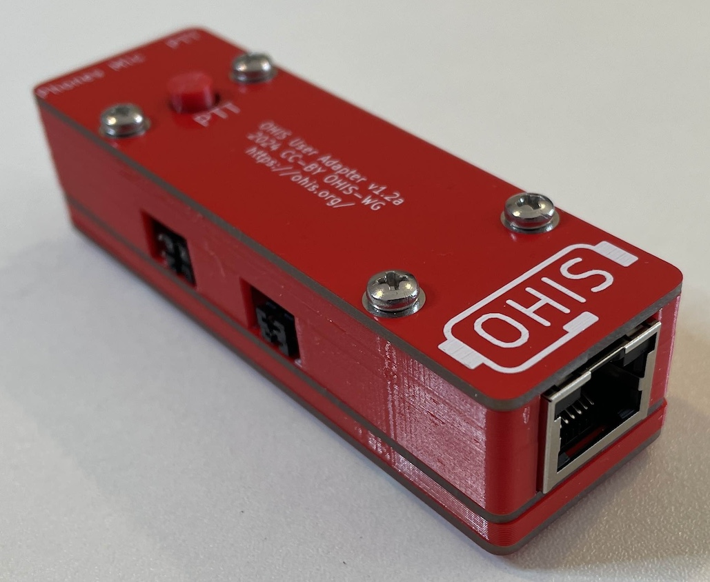
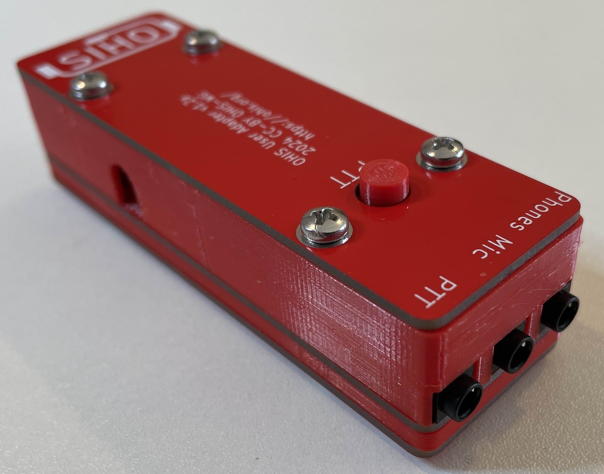
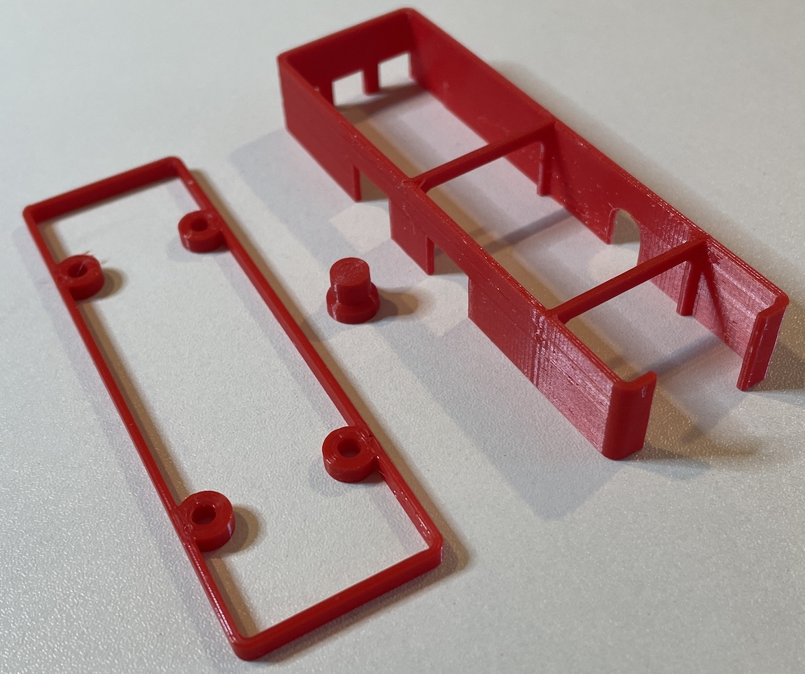

# OHIS User Adapter Shell

A printed shell for the OHIS User Adapter

## Files

* [ohisUserShell-v1.2a.stl](ohisUserShell-v1.2a.stl)  
The Shell fits between the Top Board and the User Adapter. This shell does not replace the brass stand-offs.
* [ohisBottomSpacer-v1.2a.stl](ohisBottomSpacer-v1.2a.stl)  
The Bottom Spacer replaces the nylon spacers between the Bottom Board and the User Adapter.
* [ohisButtonTopper-v1.2a.stl](ohisButtonTopper-v1.2a.stl)  
The Button Topper is a replacement for the PTT button, in case you lose it or just want a different color.
* [ohisUserShell.FCStd](ohisUserShell.FCStd)  
Parametric design in FreeCAD.

## Printing

Printing does not require any rafts or supports. 