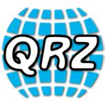

# user-adapter  

An open-source OHIS User adapter circuit for common headset types  

## Contributors  

Add your information below when submitting a Pull Request:  

* Mark "Smitty" Smith, [N6MTS](https://www.qrz.com/db/N6MTS)  
    ~~President, CEO~~ Head Cheese of Halibut Electronics  
    [ mark-ohis@electronics.halibut.com](mailto:mark-ohis@electronics.halibut.com)  
    [ @smitty@halibut.com](https://mastodon.halibut.com/@smitty)  
    [ @smittyhalibut](https://github.com/smittyhalibut)  
    [ electronics.halibut.com](https://electronics.halibut.com/)  

* Derek Rowland, NZ0P       

* Dan Malone, AK6DM
    [ danmalone326@gmail.com](mailto:danmalone326@gmail.com)  